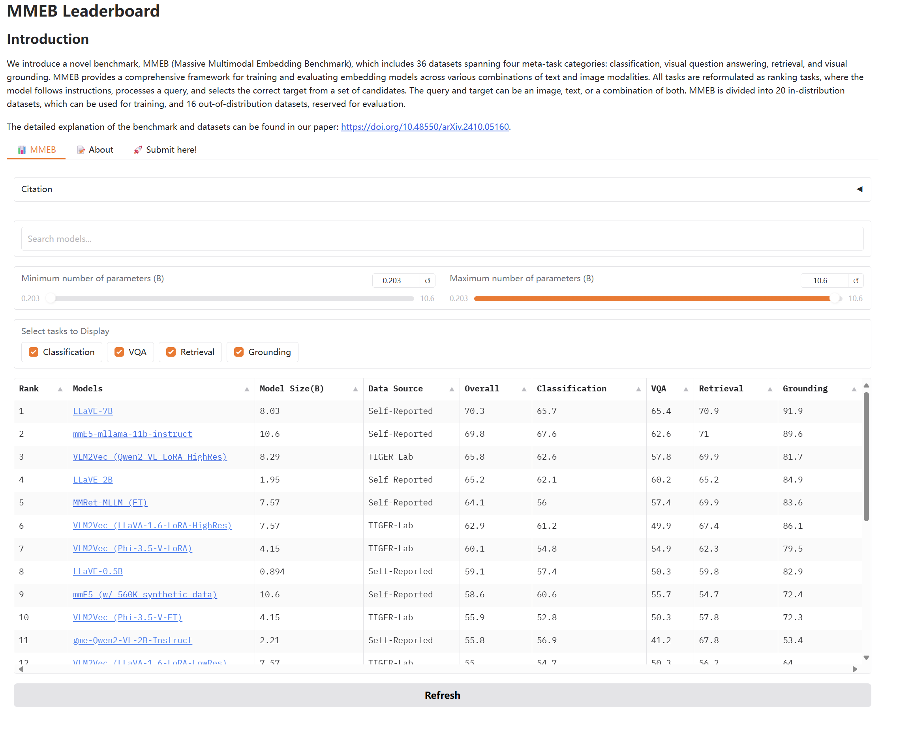
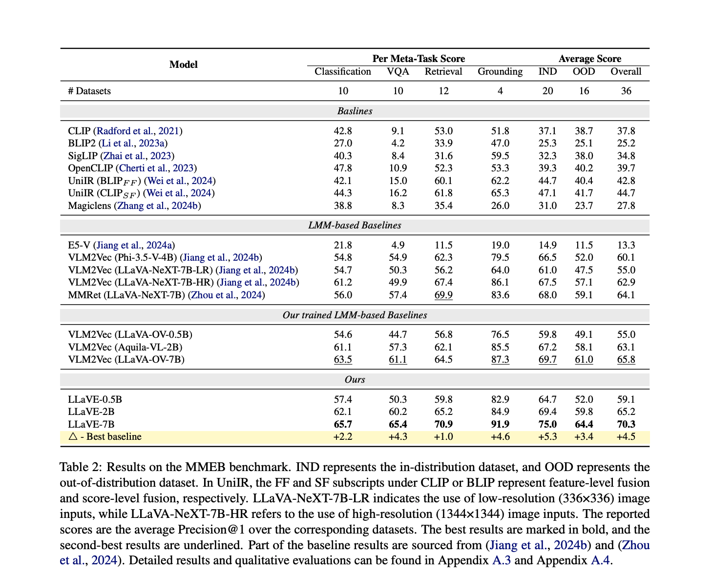
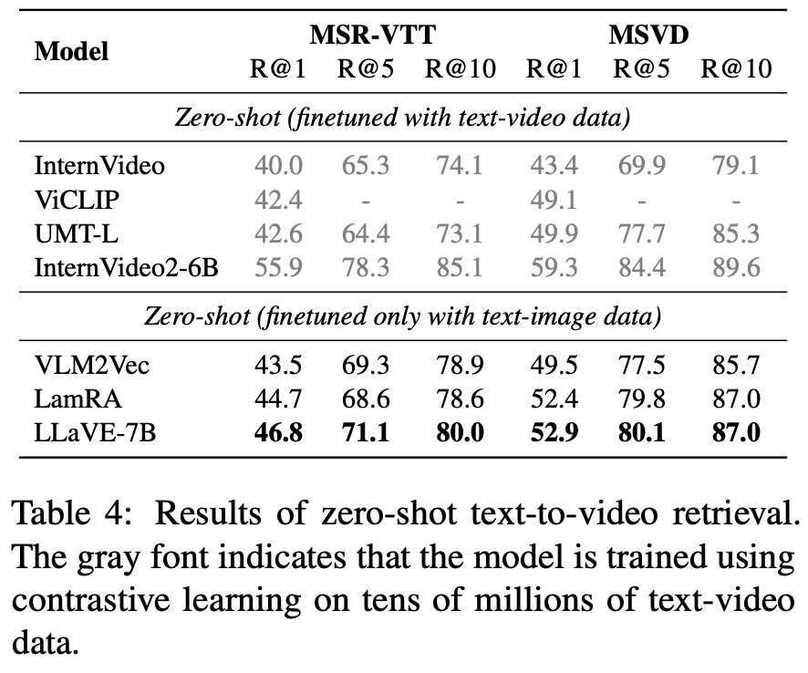

# LLaVE: Large Language and Vision Embedding Models with Hardness-Weighted Contrastive Learning

This repo contains the code and data for [LLaVE: Large Language and Vision Embedding Models with Hardness-Weighted Contrastive Learning](https://arxiv.org/abs/2503.04812?context=cs.CV), we have developed a series of more powerful unified multimodal embedding models that can accept inputs combining text and images, and even video.


<a target="_blank" href="https://arxiv.org/abs/">
</a>
<a target="_blank" href="https://github.com/DeepLearnXMU/LLaVE">
</a>
<a target="_blank" href="https://huggingface.co/zhibinlan/LLaVE-0.5B">
</a>
<a target="_blank" href="https://huggingface.co/zhibinlan/LLaVE-2B">
</a>
<a target="_blank" href="https://huggingface.co/zhibinlan/LLaVE-7B">
</a>

## Release Notes

- **[2025/03/10]** 🔥 We are excited to release **LLaVE-0.5B, LLaVE-2B, LLaVE-7B**. The paper, models, and inference code are now publicly available.

## MMEB Leaderboard
We achieved the top ranking on the MMEB leaderboard using only a small amount of data.




## Model Performance
LLaVE-7B achieved the SOTA performance on MMEB using only 662K training pairs.


Although LLaVE is trained on image-text data, it can generalize to text-video retrieval tasks in a zero-shot manner and achieve strong performance, demonstrating its remarkable potential for transfer to other embedding tasks.


## Models & Scripts


### Installation

#### 1. **Clone this repository and navigate to the LLaVA folder:**
```bash
git clone https://github.com/DeepLearnXMU/LLaVE
cd LLaVE
```
#### 2. **Install the inference package:**
```bash
conda create -n llave python=3.10 -y
conda activate llave
cd llave
pip install --upgrade pip  # Enable PEP 660 support.
pip install -e ".[train]"
```
## Quick Start
```python
import torch
import copy
from PIL import Image
from llava.constants import IMAGE_TOKEN_INDEX, DEFAULT_IMAGE_TOKEN
from llava.conversation import conv_templates
from llava.model.builder import load_pretrained_model
from llava.mm_utils import tokenizer_image_token, process_images

pretrained = "zhibinlan/LLaVE-0.5B"
model_name = "llava_qwen"
device = "cuda"
device_map = "auto"
tokenizer, model, image_processor, max_length = load_pretrained_model(pretrained, None, model_name, device_map=device_map)  # Add any other thing you want to pass in llava_model_args
model.eval()

# Image + Text -> Text
image = Image.open("figures/example.jpg")
image_tensor = process_images([image], image_processor, model.config)
image_tensor = [_image.to(dtype=torch.float16, device=device) for _image in image_tensor]
conv_template = "qwen_1_5"  # Make sure you use correct chat template for different models

question = DEFAULT_IMAGE_TOKEN + " Represent the given image with the following question: What is in the image"
conv = copy.deepcopy(conv_templates[conv_template])
conv.append_message(conv.roles[0], question)
conv.append_message(conv.roles[1], "\n")
prompt_question = conv.get_prompt()
input_ids = tokenizer_image_token(prompt_question, tokenizer, IMAGE_TOKEN_INDEX, return_tensors="pt").unsqueeze(0).to(device)
attention_mask=input_ids.ne(tokenizer.pad_token_id)
image_sizes = [image.size]
query_embed = model.encode_multimodal_embeddings(input_ids, attention_mask=attention_mask,images=image_tensor, image_sizes=image_sizes)

target_string = "A cat and a dog"
conv = copy.deepcopy(conv_templates[conv_template])
conv.append_message(conv.roles[0], target_string)
conv.append_message(conv.roles[1], "\n")
target_string = conv.get_prompt()
target_input_ids = tokenizer(target_string, return_tensors="pt").input_ids.to(device)
attention_mask=target_input_ids.ne(tokenizer.pad_token_id)
target_embed = model.encode_multimodal_embeddings(target_input_ids, attention_mask=attention_mask)

print("A cat and a dog similarity score: ", query_embed @ target_embed.T)
# 0.5B: A cat and a dog similarity score: tensor([[0.4802]]

neg_string = "A cat and a tiger"
conv = copy.deepcopy(conv_templates[conv_template])
conv.append_message(conv.roles[0], neg_string)
conv.append_message(conv.roles[1], "\n")
neg_string = conv.get_prompt()
neg_input_ids = tokenizer(neg_string, return_tensors="pt").input_ids.to(device)
attention_mask=neg_input_ids.ne(tokenizer.pad_token_id)
neg_embed = model.encode_multimodal_embeddings(neg_input_ids, attention_mask=attention_mask)
print("A cat and a tiger similarity score: ", query_embed @ neg_embed.T)
# 0.5B: A cat and a tiger similarity score: tensor([[0.3413]]
```
<!-- ## Training

Download the image file zip from huggingface.
```
git lfs install
git clone https://huggingface.co/datasets/TIGER-Lab/MMEB-train
cd MMEB-train
python unzip_file.py
cd ../
```

Run the following script to train.
```bash
prefix="your code dir"
VISION_MODEL_VERSION="google/siglip-so400m-patch14-384"
ALPHA=9
PROMPT_VERSION="qwen_1_5"
PREV_STAGE_CHECKPOINT=BAAI/Aquila-VL-2B-llava-qwen
RUN_NAME="LLaVE-2B"
torchrun --nproc_per_node=8 --master_port=20042 \
    $prefix/LLaVA-NeXT/llava/train/train_mem.py \
    --deepspeed $prefix/LLaVA-NeXT/scripts/zero3.json \
    --model_name_or_path $PREV_STAGE_CHECKPOINT \
    --version $PROMPT_VERSION \
    --data_path TIGER-Lab/MMEB-train \
    --image_folder $prefix/MMEB-train \
    --mm_tunable_parts="mm_mlp_adapter,mm_language_model" \
    --mm_vision_tower_lr=2e-6 \
    --vision_tower ${VISION_MODEL_VERSION} \
    --mm_projector_type mlp2x_gelu \
    --mm_vision_select_layer -2 \
    --mm_use_im_start_end False \
    --mm_use_im_patch_token False \
    --group_by_modality_length True \
    --image_aspect_ratio anyres_max_9 \
    --image_grid_pinpoints  "(1x1),...,(2x2)" \
    --mm_patch_merge_type spatial_unpad \
    --bf16 True \
    --run_name $RUN_NAME \
    --output_dir $prefix/checkpoints/$RUN_NAME \
    --num_train_epochs 1 \
    --per_device_train_batch_size 4 \
    --per_device_eval_batch_size 4 \
    --gradient_accumulation_steps 8 \
    --evaluation_strategy "no" \
    --save_strategy "steps" \
    --save_steps 500 \
    --save_total_limit 1 \
    --learning_rate 1e-5 \
    --weight_decay 0. \
    --warmup_ratio 0.03 \
    --lr_scheduler_type "cosine" \
    --logging_steps 1 \
    --tf32 True \
    --model_max_length 4096 \
    --gradient_checkpointing True \
    --dataloader_num_workers 4 \
    --lazy_preprocess True \
    --report_to none \
    --torch_compile True \
    --torch_compile_backend "inductor" \
    --dataloader_drop_last True \
    --frames_upbound 32 \
    --subset_name ImageNet_1K HatefulMemes SUN397 N24News VOC2007 OK-VQA A-OKVQA DocVQA InfographicsVQA ChartQA Visual7W VisDial CIRR NIGHTS WebQA VisualNews_i2t VisualNews_t2i MSCOCO_t2i MSCOCO_i2t MSCOCO \
    --num_sample_per_subset 50000 \
    --lora_enable False \
    --alpha ${ALPHA}
  ``` -->


## MMEB Inference & Evaluation

Download the image file zip from huggingface.
```bash
wget https://huggingface.co/datasets/TIGER-Lab/MMEB-eval/resolve/main/images.zip
unzip images.zip -d eval_images/
```


Run the following script to eval.
```bash
prefix="your code dir"
PROMPT_VERSION="qwen_1_5"
RUN_NAME="zhibinlan/LLaVE-2B"
python3 $prefix/LLaVA-NeXT/llava/eval/model_embed.py \
    --model_name_or_path $RUN_NAME \
    --version $PROMPT_VERSION \
    --dataset_name TIGER-Lab/MMEB-eval \
    --image_folder $prefix/MMEB-eval/eval_images/ \
    --encode_output_path $prefix/outputs/$RUN_NAME \
    --subset_name ImageNet-1K HatefulMemes SUN397 N24News VOC2007 OK-VQA A-OKVQA DocVQA InfographicsVQA ChartQA Visual7W VisDial CIRR NIGHTS WebQA VisualNews_i2t VisualNews_t2i MSCOCO_t2i MSCOCO_i2t MSCOCO Place365 ImageNet-A ImageNet-R ObjectNet Country211 ScienceQA GQA TextVQA VizWiz FashionIQ Wiki-SS-NQ OVEN EDIS RefCOCO Visual7W-Pointing RefCOCO-Matching \
    --dataset_split test --per_device_eval_batch_size 4 \
    --dataloader_num_workers 4 \
    --normalize
```

## Zero-shot Video-text Retrieval
Run the following script to eval zero-shot video-text retrieval. (The current code only supports single GPU inference for this task.)
```bash
export CUDA_VISIBLE_DEVICES=0
PROMPT_VERSION="qwen_1_5"
RUN_NAME="zhibinlan/LLaVE-7B"

python3 -m torch.distributed.launch --nproc_per_node=1 \
    $prefix/LLaVA-NeXT/CLIP4Clip/main_task_retrieval.py \
    --model_name_or_path $prefix/checkpoints/$RUN_NAME \
    --version qwen_1_5 \
    --do_eval \
    --data_path $prefix/dataset/MSVD/msvd_data \
    --features_path $prefix/dataset/MSVD/YouTubeClips \
    --output_dir $prefix/outputs/MSVD/$RUN_NAME \
    --datatype msvd \
    --batch_size_val 2 \
```


## Acknowledgement
- We have adapted code from [LLaVA-NeXT](https://github.com/LLaVA-VL/LLaVA-NeXT), which is a training framework for a family of open large multimodal models.
- We used data from [VLM2Vec](https://github.com/TIGER-AI-Lab/VLM2Vec), which includes 36 datasets.

## Citation
```
@article{lan2025llave,
  title={LLaVE: Large Language and Vision Embedding Models with Hardness-Weighted Contrastive Learning},
  author={Lan, Zhibin and Niu, Liqiang and Meng, Fandong and Zhou, Jie and Su, Jinsong},
  journal={arXiv preprint arXiv:2503.04812},
  year={2025}
}
```